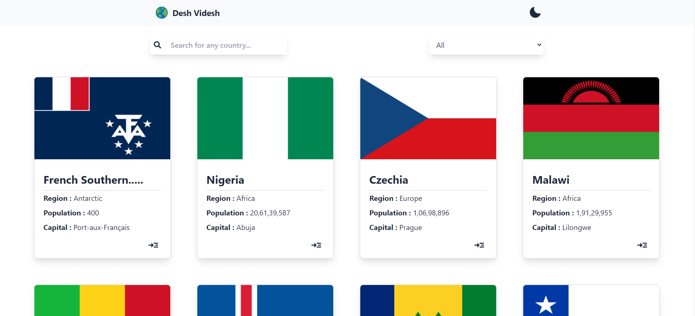
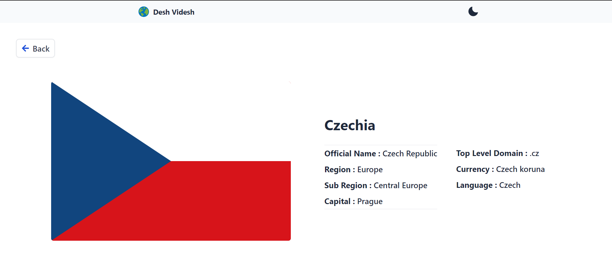

# Desh Videsh - All Countries Details with Flags




Desh Videsh is a basic React application that fetches and displays details of countries including their flags using the countries' API. The application includes features like dark mode, responsiveness, filtering, and search functionality.

## Live Demo

Check out the live demo [here](https://deshvidesh.netlify.app/).
## Features

- **Dark Mode**: Users can toggle between light and dark modes and store it in Local storage.
- **Responsive Design**: The application is designed to adapt to various screen sizes.
- **Filtering**: Users can filter countries based on region.
- **Search**: Users can search for countries by name.


## Installation

To run the project locally, follow these steps:

1. Clone the repository:
```bash
   git clone Iamaniketgupta/Countries-Details
```
2. Navigate to the project directory:
```bash
cd desh-videsh
```
3. Install dependencies:
```bash
npm install
```
4. Start the development server:
```bash
npm run dev
```

5. Open your browser and go to `http://localhost:5173` to view the application.

## Technologies Used

- React
- Vite
- Axios
- React Router
- Netlify (for hosting)

## Contributing

Contributions are welcome! Feel free to submit bug reports, feature requests, or pull requests.

## License

This project is licensed under the [MIT License](LICENSE).
